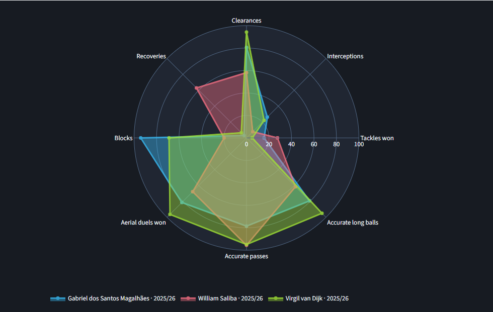
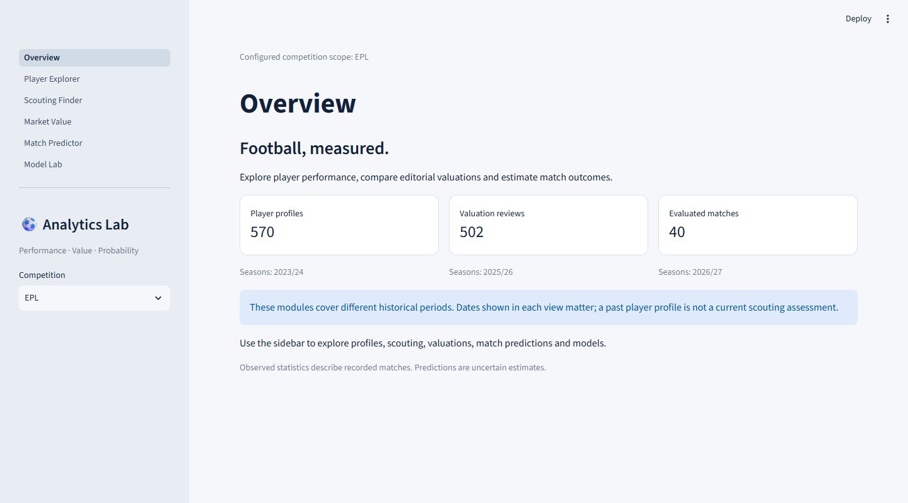
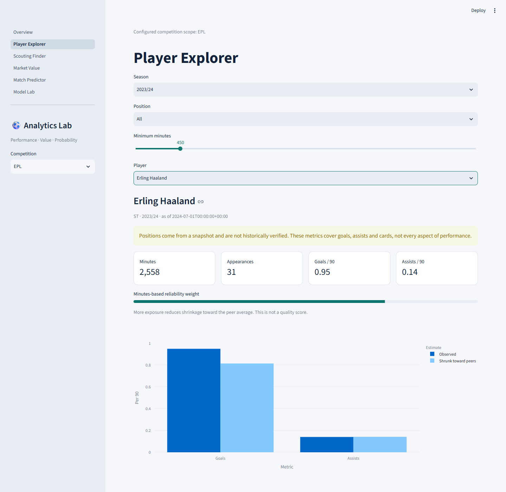
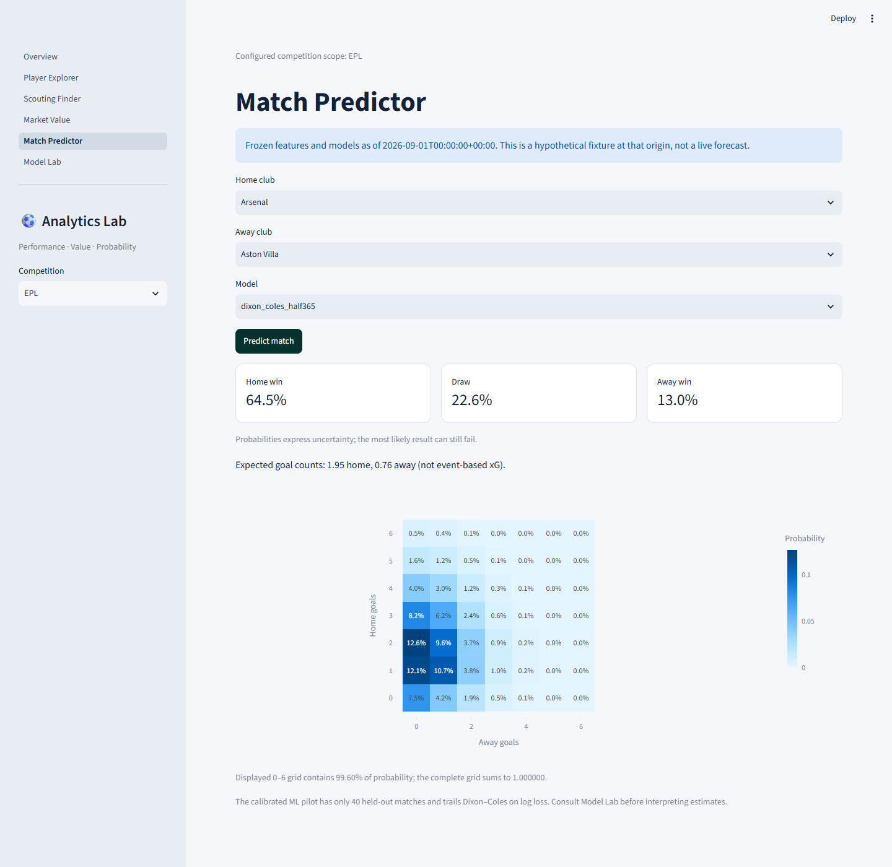
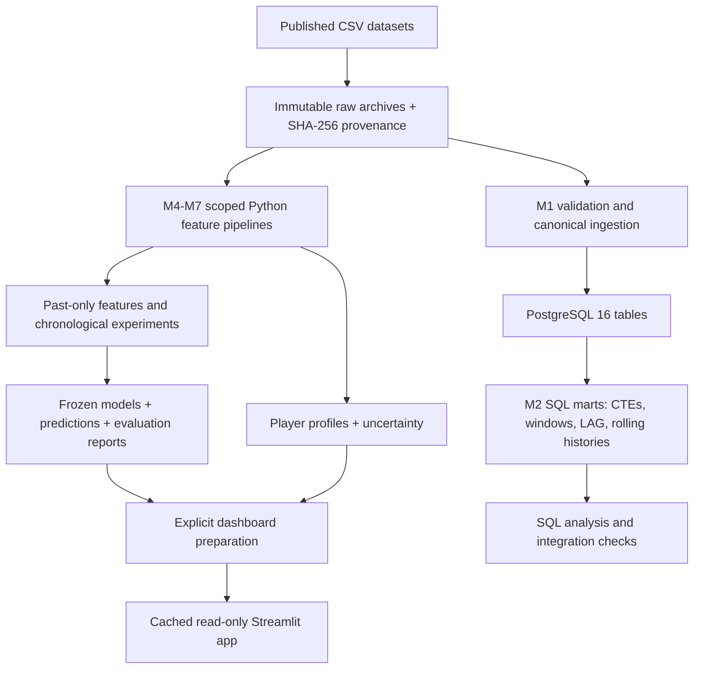

# Premier League Analytics Lab

A reproducible football analytics platform: **player performance, scouting, editorial
market-value estimation and probabilistic match forecasting**, presented in a six-page
Streamlit dashboard. Python and PostgreSQL pipelines retain source provenance and
competition/season context; chronological experiments compare simple baselines with ML.

Built by [kubaborowiec7](https://github.com/kubaborowiec7).
V1 data covers the Premier League; reusable interfaces support configured competitions.

**Local demo:** [http://localhost:8501](http://localhost:8501/) after starting the app.
There is no public hosted demo. Screenshots below use prepared historical artifacts,
not live data. The repository contains code, manifests and small evaluation reports;
raw datasets and trained bundles are excluded from Git.

## New: advanced player comparisons

Three additional player seasons: **2024/25 (562 profiles), 2025/26 (537), and partial
2026/27 (406)**. Position-aware radars overlay up to five players in distinct colors,
including cross-season comparisons. Defensive profiles emphasize tackles,
interceptions, recoveries, blocks, clearances and aerials. Dark performance panels
show totals/per-90 values, percentiles and metric coverage.

```bash
python scripts/build_advanced_players.py --download
```

The published source covers most requested shooting/passing/possession/defensive
metrics, with meaningful gaps in the newest season. Progressive passes/carries and
several other fields remain explicitly unavailable. [Definitions and reproduction](docs/ADVANCED_PLAYERS.md).



## What you can explore

| Page | Working functionality |
|---|---|
| Overview | Data-driven competition selector and coverage by module |
| Player Explorer | 2023/24 legacy profiles plus three advanced seasons, position-aware metrics and radar overlays |
| Scouting Finder | Comparable profiles with explicit candidate competitions, metric selection and exposure threshold |
| Market Value | 502 dated player reviews, observed vs predicted values and nominal 90% intervals |
| Match Predictor | Frozen-origin H/D/A probabilities; Poisson/Dixon–Coles score matrices |
| Model Lab | Chronological benchmark tables, selection decisions and model cards |





## Measured results

Lower loss/error is better. Compare rows **within the same experiment**; the match
experiments use different final periods. Model selection was frozen before final evaluation.

| Experiment / final period | Model | Observations | Primary metric | Comparison |
|---|---|---:|---:|---|
| Market value · 2025-07-01–2026-06-30 | Ridge EUR | 1,301 | MAE **€3.612m** | Persistence €3.687m; median €17.390m |
| Match statistics · 2025/26 | Time-weighted Dixon–Coles | 380 | Log loss **1.0263** | Base rate 1.0844; weighted Poisson 1.0274 |
| Match ML · 2026-08-21–2026-09-14 | Calibrated logistic | 40 | Log loss **1.0491** | Same-fixture Dixon–Coles **1.0115**; base rate 1.1323 |

The valuation model's small MAE improvement over persistence is uncertain. Its
**€11.193m RMSE exposes severe low-minute extrapolation errors**; it is a research
benchmark, not a production valuation tool. Dixon–Coles barely improves on Poisson.
The 40-match ML pilot trails the statistical model and is too small to establish
robust superiority or calibration. More complex models did not automatically win.

Detailed evidence: [value model card](reports/model_cards/player_value.md),
[statistical match card](reports/model_cards/match_statistics.md),
[match ML card](reports/model_cards/match_ml.md).

## Architecture



The later appearance/model pipelines use local prepared files; they do not silently
populate the earlier SQL marts or assume cross-source IDs match. PostgreSQL is
valuable for canonical ingestion and SQL analytics, but optional for serving the app.
See [architecture](docs/ARCHITECTURE.md) and [SQL analytics](docs/SQL_ANALYTICS.md).

## Quick start: no data or database required

Use **Python 3.12** and run from the repository root:

```bash
python -m venv .venv
source .venv/bin/activate
python -m pip install -c requirements/constraints.txt -e ".[dev]"
python -m compileall src
ruff check .
pytest
streamlit run app/Home.py --server.address=127.0.0.1
```

On Windows, replace activation with `.venv/Scripts/Activate.ps1`. If activation is
blocked, use `.venv/Scripts/python.exe` and the executables in `.venv/Scripts/`
directly. An empty installation opens explanatory missing-artifact states.

Optionally copy `.env.example` to `.env` on first setup, preserving an existing file.
Environment variables override `.env`; explicit settings arguments override both.

| Setting | Default / purpose |
|---|---|
| `ACTIVE_COMPETITIONS` | `EPL`; comma-separated canonical codes |
| `DATA_DIR` | `data`; raw inputs are immutable and ignored by Git |
| `ARTIFACT_DIR` | `artifacts`; prepared models and reports |
| `DATABASE_URL` | Local `postgresql+psycopg` URL; only needed for SQL work |
| `DATABASE_CONNECT_TIMEOUT` | 5 seconds |
| `LOG_LEVEL` | `INFO` |
| `FOOTBALL_DATA_API_TOKEN` | Reserved; optional API adapter is not implemented |

The UI discovers competition choices from available artifacts within the configured
scope. Adding a code alone does not create data or a fitted model for that competition.

## Build populated analytics

The commands below explicitly download published datasets when missing. They do
not scrape Transfermarkt or FBref. Source hashes are pinned; changed upstream bytes
fail validation. Preserve the current-season raw archive: its provider URL is mutable,
so a future clean download may not reproduce the exact 40-match pilot.

```bash
python scripts/build_player_analytics.py --download
python scripts/train_value_models.py --stage select --download
python scripts/train_value_models.py --stage final
python scripts/plot_value_report.py
python scripts/train_match_models.py --stage select --download
python scripts/train_match_models.py --stage final --download
python scripts/plot_match_report.py
python scripts/train_match_ml.py --stage select --download
python scripts/train_match_ml.py --stage final --download
python scripts/plot_match_ml.py
python scripts/build_dashboard_data.py
streamlit run app/Home.py --server.address=127.0.0.1
```

Selection outputs are frozen. For a fresh reproduction after selection already exists,
use the documented new output directory; do not overwrite an evaluated experiment.
Full contracts and refresh instructions: [player analytics](docs/PLAYER_ANALYTICS.md),
[value models](docs/VALUE_MODELS.md), [statistical matches](docs/MATCH_MODELS.md),
[match ML](docs/MATCH_ML.md), [dashboard](docs/DASHBOARD.md).

For the separate PostgreSQL and exploratory notebook path:

```bash
docker compose --env-file .env.example config --quiet
docker compose up -d --wait db
pl-db-smoke
python scripts/verify_ingestion.py --load --initialize-schema
python scripts/verify_analytics.py --install --manifest data/manifests/m1_sources.json
python scripts/run_quality.py
python scripts/execute_quality_notebook.py
```

Initialization affects only an empty PostgreSQL volume; the explicit verification
commands apply the documented additive schema updates. `docker compose down`
preserves the named data volume. See [ingestion](docs/INGESTION.md) and
[data quality](docs/DATA_QUALITY.md).

## Engineering and validation

- Past-only features, shifted histories and training-only preprocessing; no random temporal splits.
- Separate training, selection, calibration and final evaluation windows.
- Elo, Poisson, Dixon–Coles, logistic and XGBoost comparisons; log loss, Brier, RPS and calibration.
- Median/persistence, OLS, Ridge/Lasso and boosting valuation baselines; direct/log targets and SHAP.
- Automated leakage, likelihood-gradient, probability-mass, replay and UI failure-path tests.
- Immutable source archives, checksums, retrieval metadata and documented analytical grains.
- GitHub Actions: Ruff, pytest, PostgreSQL 16 integration, pinned experiment reproduction,
  coverage reporting with an 80% gate, and non-root container smoke tests.

Local verification on 2026-09-16: **150 tests passed**, **13 PostgreSQL tests skipped**
without a local server; **87.45% package statement coverage**. PostgreSQL is tested
separately in CI. Coverage does not imply statistical validity.

```bash
pytest --cov=pl_analytics --cov-fail-under=80 --cov-report=xml:artifacts/coverage.xml
python -m pip check
docker compose -f compose.app.yml up --build -d
```

The serving image contains code/model cards, not source datasets. It runs as non-root
with read-only artifact mounts. Direct dependency versions are constrained; this is
not a fully hermetic dependency lock. [Deployment guide](docs/DEPLOYMENT.md) ·
[security review](docs/SECURITY_REVIEW.md) · [CI runs](https://github.com/kubaborowiec7/Premier-League-Analytics-Lab/actions).

## Data attribution and limitations

- Match results: [Football-Data.co.uk](https://www.football-data.co.uk/).
- Published player/appearance/value snapshots: [dcaribou/transfermarkt-datasets](https://github.com/dcaribou/transfermarkt-datasets).
  Transfermarkt editorial values are estimates, not observed transfer fees.
- Every acquired snapshot retains source URL, retrieval date, version/hash and terms notes.
  Public availability does not imply unrestricted redistribution. See [data sources](docs/DATA_SOURCES.md).
- Snapshot positions are not verified historical roles. Historical membership and
  publication/revision vintages remain incomplete. Source identities are not silently merged.
- Player features cover goals, assists and cards; no event-based xG, possession adjustment,
  or injury/lineup feed is claimed. Scouting distance is resemblance, not player quality.
- Forecasts use monthly frozen information, not real-time lineups. The dashboard's
  displayed origin is part of every interpretation. Probabilities are not certainties.
- No public deployment, automated betting, Transfermarkt/FBref scraper, or football-data.org
  integration is included. Optional event-data work remains outside this release.

## Repository guide

`src/pl_analytics/` contains reusable ingestion, features, statistics, models and UI code.
`sql/` contains PostgreSQL schema, migrations, marts and query examples.
`data/manifests/` pins experiments; `reports/model_cards/` stores small evaluation evidence.
`app/` defines pages; `scripts/` provides explicit build/evaluation commands.
`tests/` uses synthetic fixtures by default; `notebooks/` is exploratory.

[Milestones and verification](docs/MILESTONES.md) · [Statistical methodology](docs/STATISTICS.md) ·
[Portfolio description](docs/PORTFOLIO.md) · [Release notes](docs/RELEASE.md)
