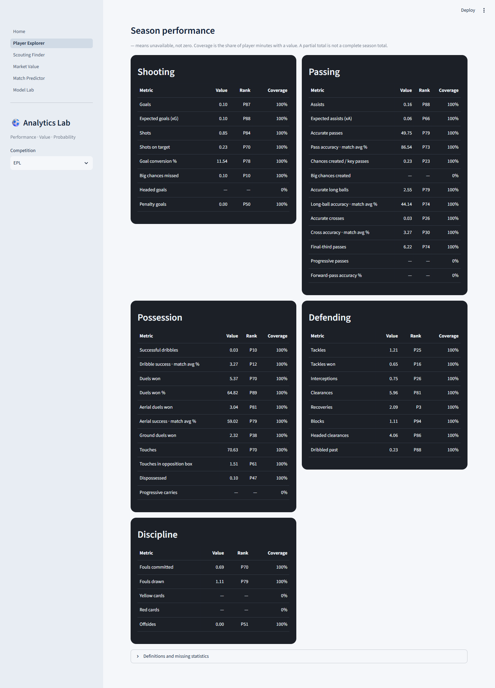

# Advanced player profiles and comparison

This extension adds position-aware statistics and multi-player radar overlays after
the frozen v1 model experiments. It does not retrain models or feed retrospective
season aggregates into historical forecasts.

## Reproduction

```bash
python scripts/build_advanced_players.py --download
streamlit run app/Home.py --server.address=127.0.0.1
```

Subsequent offline builds omit `--download`. The manifest
`data/manifests/advanced_players.json` pins Git commit
`d2b7c3a7f9bc7ba4781efef1fda2408b12d4d5cb` of
[olbauday/FPL-Core-Insights](https://github.com/olbauday/FPL-Core-Insights),
89 CSV files and their SHA-256 hashes. It downloads only published GitHub CSVs,
never underlying sports sites. Immutable payloads and retrieval metadata live under
`data/raw/fpl-core.*`; derived files live under `data/processed/advanced/`.

The publisher's README permits reuse and requests attribution. This is not an
independent licence grant for every upstream provider. The app is a local research
demo; bulk raw data is not redistributed in Git or the container image.

| Season | Matches | Players with positive recorded minutes | Coverage |
|---|---:|---:|---|
| 2024/25 | 380 | 562 | Full league season in the pinned archive |
| 2025/26 | 380 | 537 | Full league season; some individual metrics have gaps |
| 2026/27 | 40 | 406 | Partial season through 2026-09-14; substantial metric gaps |

The earlier M4 2023/24 view remains available with its explicitly limited goals,
assists and cards. Its Transfermarkt identities are not silently merged with FPL IDs.
The advanced pipeline uses stable `player_code` across seasons; season-local
`player_id` is used only for joining that season's source tables.

## Statistical definitions

- Grain: one player / competition / season at a declared reference date.
- Only completed source matches strictly before the reference date contribute.
  Zero-minute bench rows do not create appearances or contribute statistics.
- Counts are summed over observed values. Missing values remain missing. Coverage
  is observed metric minutes divided by all recorded player minutes.
- Per-90 counts use **observed metric minutes**, not all minutes when data is partial.
  Partial totals and coverage are displayed together. They are not full-season totals.
- Source percentage fields do not expose attempt counts. The displayed **match avg %**
  is a minutes-weighted mean of rounded match percentages, not the true aggregate
  success rate. No attempts are inferred from rounded percentages.
- Goal conversion and overall duel win rate use summed paired known numerators and
  denominators. A zero denominator stays undefined.
- Percentiles use midranks within competition / season / broad position, at least
  five peers, the user-selected minutes threshold and at least 90% metric coverage.
  Lower adverse counts (fouls, cards, being dispossessed/dribbled past) get higher ranks.
  Other axes rank volume; more volume is not necessarily better tactical performance.
- These are empirical descriptive percentiles, not confidence intervals or latent
  ability estimates. Early-season/low-exposure comparisons are unstable.

## Available and unavailable metrics

The registry in `features/advanced_players.py` distinguishes Shooting, Passing,
Possession, Defending, Discipline and Goalkeeping. It includes goals, xG, shots,
shots on target, penalties, assists, xA, accurate passes/crosses/long balls, key passes,
dribbles, duels, aerials, touches, dispossessions, tackles, interceptions, recoveries,
blocks, clearances, fouls, offsides and provider goalkeeper measures where recorded.

Absent fields are shown as **—**, never fabricated: progressive passes/carries,
forward-pass completion, headed goals, big chances created and player yellow/red
cards are not supplied by this adapter. Final-third passes are not relabelled as
progressive passes; ground duels are not relabelled as defensive-only duels.
Some otherwise supported metrics are missing entirely from the newest snapshot.

Positions are broad FPL season labels: GK, DEF, MID, FWD. DEF includes centre-backs
and full-backs. Historical roles, age and match-specific club membership are not
inferred from a current profile. No possession or competition-strength adjustment
is invented.

## Interface

Player Explorer and Scouting Finder use advanced views for the three new seasons.
Choose a position and reference player, then overlay up to four others in distinct
colors. The same player in another season is supported. All curves share 0–100 axes;
each season uses its own documented peer context. Only metrics eligible for every
selected player can enter the radar. Missing points are never drawn as zero.

Scatterplots expose selectable raw per-90/percentage axes, peer clouds and matching
selection colors. Scouting computes Euclidean distance in the selected percentile
space, with an explicit candidate competition universe, same season/role/reference
date and the same coverage gates. Similarity is resemblance, not player quality.
The dark performance panels switch between totals and per 90 while percentage
metrics retain their units. Tables show per-metric coverage and peer ranks.
`P80` means the 80th percentile in the documented peer cohort.




## Output schema and refresh

`player_profiles.parquet` contains identity, competition, season, player name,
position/context, minutes, appearances, reference date, last match date, source,
and for each registry metric: raw/derived total or percentage, `_per90`, `_coverage`.
`coverage.json` records source commit, reference date, season counts and non-missing
player counts per metric. UI percentiles and peer counts are cached by prepared
frame and the selected threshold; normalization context is retained.

To refresh, select a reviewed new upstream commit, archive its new payloads and
record a new manifest version/counts. Never alter old raw files or the frozen M5–M7
experiments. Multiple competitions use configuration/mapping, not copied pipelines.
